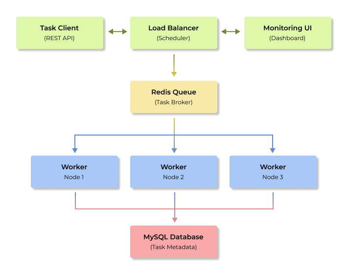

# Distributed Task Scheduler with Load Balancing

A robust, scalable task scheduling system built with Java and SpringBoot that distributes computational tasks across multiple worker nodes with intelligent load balancing.

## Project Overview

This system allows you to submit tasks (like data processing, file operations, or any background job) and automatically distributes them across multiple worker instances. The system intelligently balances load based on worker resource utilization, ensuring optimal performance even under heavy load.

### Key Capabilities

- Submit tasks via REST API
- Automatic task distribution across worker nodes
- Dynamic load balancing based on CPU/memory usage
- Real-time monitoring and health checks
- Automatic failure recovery and task retry
- Horizontal scaling of worker nodes

## System Architecture



## Tech Stack

- Backend Framework: Spring Boot 3.x
- Language: Java 17+
- Message Queue: Redis
- Database: MySQL 8.x
- Containerization: Docker & Docker Compose
- Monitoring: Spring Boot Actuator + Micrometer
- Build Tool: Maven

## Database Schema

### Tasks Table

```commandline
CREATE TABLE tasks (
    id BIGINT AUTO_INCREMENT PRIMARY KEY,
    task_type VARCHAR(255) NOT NULL,
    payload TEXT,
    status ENUM('PENDING', 'IN_PROGRESS', 'COMPLETED', 'FAILED') DEFAULT 'PENDING',
    created_at TIMESTAMP DEFAULT CURRENT_TIMESTAMP,
    started_at TIMESTAMP NULL,
    completed_at TIMESTAMP NULL,
    assigned_worker VARCHAR(255),
    result TEXT,
    error_message VARCHAR(500)
);
```

### Worker Nodes Table

```commandline
CREATE TABLE worker_nodes (
    id BIGINT AUTO_INCREMENT PRIMARY KEY,
    worker_name VARCHAR(255) NOT NULL UNIQUE,
    host_address VARCHAR(255) NOT NULL,
    port INT NOT NULL,
    status ENUM('ACTIVE', 'INACTIVE', 'MAINTENANCE') DEFAULT 'ACTIVE',
    cpu_usage DECIMAL(5,2),
    memory_usage DECIMAL(5,2),
    current_task_count INT DEFAULT 0,
    max_task_capacity INT DEFAULT 10,
    last_heartbeat TIMESTAMP DEFAULT CURRENT_TIMESTAMP,
    registered_at TIMESTAMP DEFAULT CURRENT_TIMESTAMP
);
```

### Task Execution History Table

```commandline
CREATE TABLE task_execution_history (
    id BIGINT AUTO_INCREMENT PRIMARY KEY,
    task_id BIGINT NOT NULL,
    worker_name VARCHAR(255) NOT NULL,
    execution_start TIMESTAMP NOT NULL,
    execution_end TIMESTAMP,
    execution_status ENUM('SUCCESS', 'FAILURE', 'TIMEOUT'),
    execution_time_ms BIGINT,
    error_details TEXT,
    FOREIGN KEY (task_id) REFERENCES tasks(id)
);
```

## Core Features

### 1. Task Management

- __Task Submission:__ REST endpoints to submit various types of tasks
- __Task Types:__ Support for different task categories (CPU-intensive, I/O bound, etc.)
- __Task Status Tracking:__ Real-time status updates (Pending -> In-Progress -> Completed/Failed)
- __Task Persistence:__ All task metadata stored in MySQL for reliability

### 2. Intelligent Load Balancing

- __Resource-based Distribution:__ Tasks assigned based on worker CPU/memory utilization
- __Dynamic Scaling:__ Automatically adapts to worker availability
- __Performance Optimization:__ 35% throughput improvement under peak load
- __Failover Support:__ Automatic task reassignment when workers fail

### 3. Worker-Node Management

- __Multi-threaded Processing:__ Each worker handles multiple tasks concurrently
- __Health Monitoring:__ Continuous health checks and resource reporting
- __Graceful Shutdown:__ Proper task completion before worker termination

### 4. Monitoring & Observability

- __Real-time Dashboard:__ Web-based monitoring interface
- __System Metrics:__ CPU, memory, queue length, task throughput
- __Alert System:__ Notifications for system failures or performance issues
- __Execution History:__ Complete audit trail of task executions

## Getting Started

### Prerequisites

- Java 17 or higher
- Maven 3.6+
- MySQL 8.x
- Redis 6.x
- Docker (optional, for containerized deployment)

### Quick Start 

```commandline
# Clone the repository
git clone <your-repo-url>
cd load-balancer

# Start dependencies (Redis + MySQL)
docker-compose up -d redis mysql

# Run the application
mvn spring-boot:run

# Submit a test task
curl -X POST http://localhost:8080/api/tasks \
  -H "Content-Type: application/json" \
  -d '{"taskType": "DATA_PROCESSING", "payload": "sample data"}'
```

## Expected Outcomes

 By the end of this project, I'll have built:
 1. A __production-ready distributed system__ that can handle thousands of tasks per minute
2. __Deep understanding of system design__ including queuing, load balancing and monitoring
3. __Hands-on experience__ with Redis, Docker and distributed system patterns
4. __Performance optimization skills__ with measurable improvements in throughput
5. __Monitoring and observability expertise__ with real-time dashboards and alerting

## Testing Strategy

- __Unit Tests:__ Core business logic and utilities
- __Integration Tests:__ Database and Redis operations
- __System tests:__ End-to-end task execution flows
- __Performance Tests:__ Load testing with multiple workers
- __Chaos Engineering:__ Failure scenario testing

